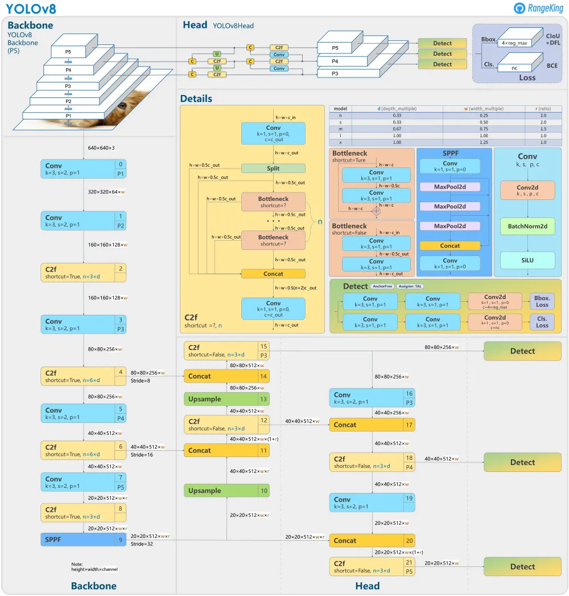
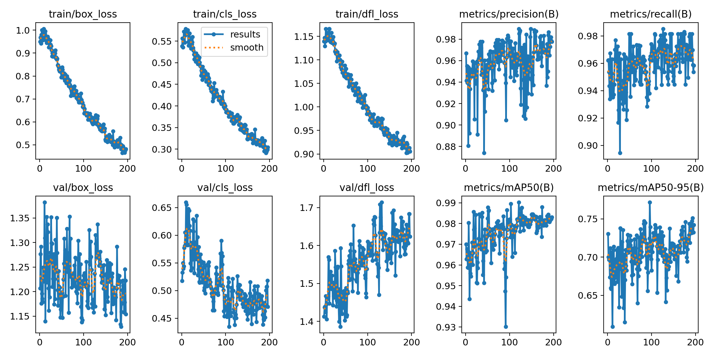
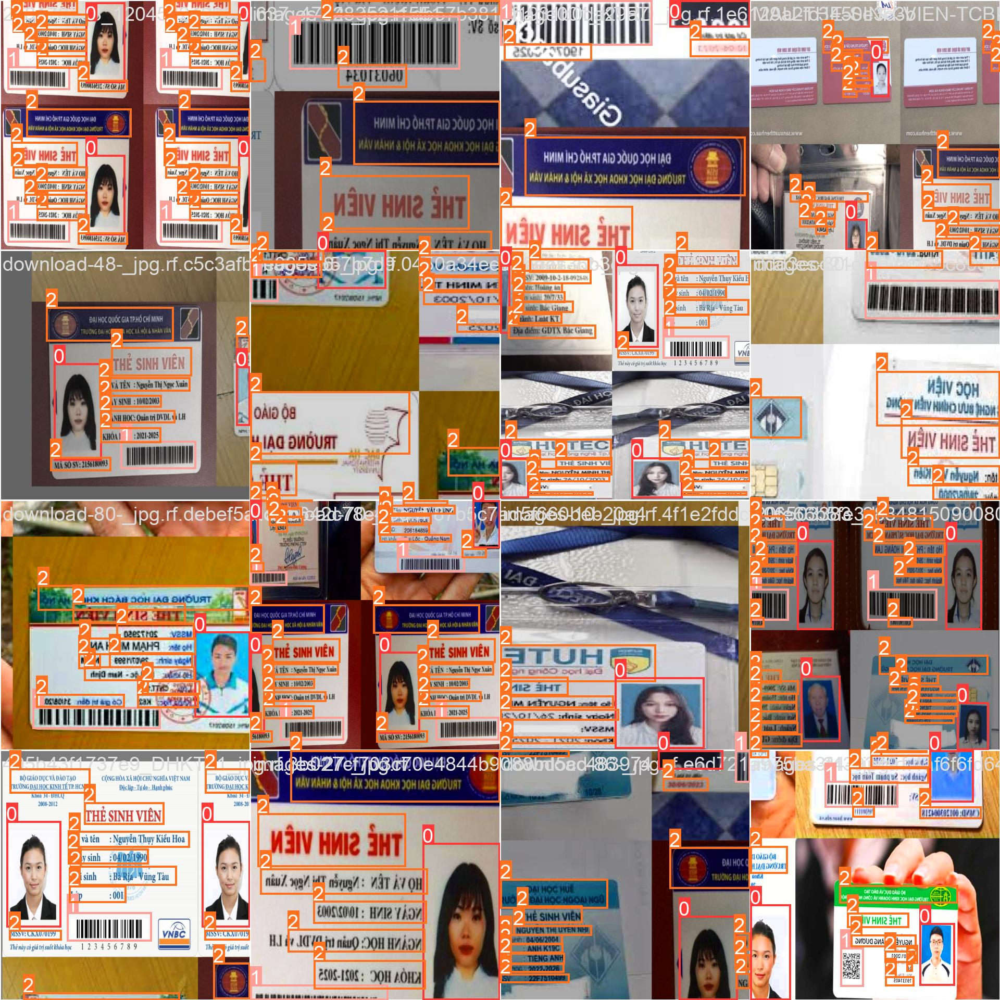
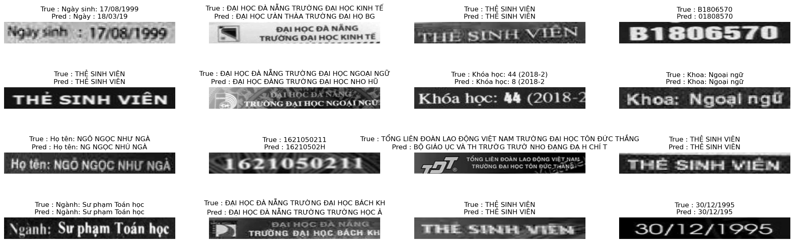

# Read Student Card

## Tab of Content

* [Introduction](#introduction)
* [Pipeline](#pipeline)
* [DetectionObject](#detection-object)
* [OCR](#ocr)
* [Run project](#run-project)
## Introduction
- A small project applying deep learning models to retrieve important information in student cards. 
- Applying YOLOv8 object detection model, build OCR image to convert text from image to text.
## Pipeline
- The student card image will be passed through the YOLOv8 model to detect the image area with text, avatar, and QR code (if any). 
- Next, the image areas with text will be cut into separate images and grayscale. 
- Finally, it will be passed to the OCR model to get the information.
## Detection Object
Using YOLO model to detect image area with text, avatars and QR codes

Results of the training

Testing on a sample image

## OCR
Apply CNN, Bi-LSTM ,and CTC loss architecture to build OCR model.
- Result of model

## Run Project
 - Clone repo to your local machine and move to it
```Terminal
git clone git@github.com:tinh2044/ReadStudentCard.git
cd ./ReadStudentCard
```
- Create virtual environments with [conda](https://conda.io/projects/conda/en/latest/index.html) to avoid conflicts

```Terminal
conda create --name readStudentCard
conda activate readStudentCard
```

- Install requirements.

```Terminal
pip install -r ./requirements.txt
```
- Run server by command
```Terminal
uvicorn server.app.main:app --host 127.0.0.1 --port 5000
```
- Testing project with sample image, run `index.html` file in client folder
